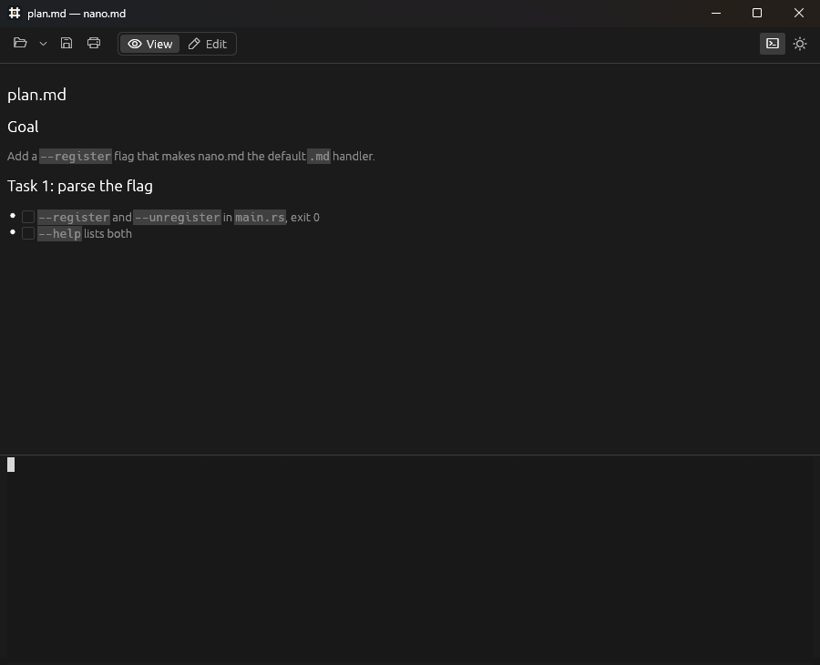

#  nano.md

A small desktop app for reading and editing Markdown files.

[](https://github.com/odysseia06/nanomd/actions/workflows/ci.yml)
[](#license)

LLMs keep leaving me with Markdown files: plans, specs, reviews, notes. I
built nano.md because I wanted to open those files quickly, read through
them, and change a few things. Sometimes I'd rather ask the agent to review
or revise the file, so there's a terminal pane for that too.

Open a `.md` file and it shows up rendered. Press `Ctrl+E` to edit the source,
or open the terminal and work with your agent while keeping the document in
view. When the file changes on disk, the preview updates.



Written in Rust with egui. Runs on Windows, macOS, and Linux. No account,
telemetry, or built-in AI service; you use whichever agent you already have
installed.

## Install

Download the archive for your system from the
[latest release](https://github.com/odysseia06/nanomd/releases/latest):

| System               | Archive                                            |
|----------------------|----------------------------------------------------|
| Windows (x86-64)     | `nanomd-<version>-x86_64-pc-windows-msvc.zip`      |
| macOS, Apple Silicon | `nanomd-<version>-aarch64-apple-darwin.tar.gz`     |
| macOS, Intel         | `nanomd-<version>-x86_64-apple-darwin.tar.gz`      |
| Linux (x86-64)       | `nanomd-<version>-x86_64-unknown-linux-gnu.tar.gz` |

- **Windows:** unzip and run `nanomd.exe`. The executable is unsigned, so the
  first launch may show a SmartScreen warning: choose **More info**, then
  **Run anyway**.
- **macOS:** extract the archive and move `nanomd.app` to Applications. The app
  is not Developer ID signed or notarized, so macOS blocks the first launch.
  After that first attempt, open **System Settings → Privacy & Security** and
  choose **Open Anyway** ([Apple's instructions](https://support.apple.com/en-us/102445)).
- **Linux:** extract and run `./nanomd`. It needs glibc 2.35 or newer
  (Ubuntu 22.04 and later) and an X11 or Wayland desktop.

Each release includes `SHA256SUMS.txt`; see [how to verify a download](SECURITY.md#verifying-a-download).
Package-manager installs (Scoop, Homebrew, AUR) aren't available yet.

### Build from source

Install stable Rust and your platform's build tools. On Windows, use the
MSVC toolchain with Visual Studio C++ Build Tools; on macOS, install the
Xcode Command Line Tools. Linux packages are listed in
[CONTRIBUTING.md](CONTRIBUTING.md#build-and-test).

```sh
git clone https://github.com/odysseia06/nanomd.git
cd nanomd
cargo build --locked --release --features cjk-font
```

The executable is `target/release/nanomd` (`nanomd.exe` on Windows). The
`cjk-font` feature bundles a font for Chinese, Japanese, and Korean text in
the preview and terminal. Omit it for a smaller build if you don't need those
characters.

## Open a file

```sh
nanomd plan.md
```

You can also use `Ctrl+O`, drag a file onto the window, or associate `.md`
files with nano.md and double-click them. Starting without a file opens an
empty document, or a short welcome page if you haven't opened a file yet. The
Open menu keeps a list of recent files, and a recent file reopens where you
left it, in the view (rendered or raw) you left it in. The window keeps its
size and position between sessions.

In a long document, the headings button next to View / Edit lists the
document's headings; click one to jump to it.

To make nano.md your default Markdown app, run `nanomd --register`. It needs
no admin rights, and `nanomd --unregister` undoes it.

- **Windows:** registers nano.md for `.md` and `.markdown` files, then opens
  *Settings → Default apps*, where you choose it: Windows doesn't let an app
  make itself the default.
- **macOS:** if `nanomd` isn't on your PATH, run the one inside the app:
  `/Applications/nanomd.app/Contents/MacOS/nanomd --register`. Unregistering
  hands Markdown files back to TextEdit, unless you've chosen another app
  since.
- **Linux:** adds a `.desktop` file and an icon under `~/.local/share` and
  sets nano.md as the default with `xdg-mime`.

By hand instead: on Windows, right-click a `.md` file, choose *Open with*,
browse to `nanomd.exe`, and select *Always*; on macOS, select a `.md` file in
Finder, then *Get Info → Open with → nano.md → Change All…*.

## Work with an agent

Press `` Ctrl+` `` to open the terminal pane, then start `claude`, `codex`,
`aider`, or whichever CLI you use. The shell starts in the open file's folder.
You can ask the agent to review the document, rewrite a section, or make a
change while you read along.

When the file changes on disk, nano.md reloads it and puts a bar in the
margin beside each heading, paragraph, list item or code block that changed,
in both views; the bar above the document counts them, and the blocks that
were removed. Its arrows step through the changes. The marks clear when you
edit the document or close them with the x.

If the agent changes the file while you have unsaved edits, nano.md offers
**Reload** or **Keep mine**. Reload uses the version on disk; Keep mine keeps
your edits for the next save. Saving also checks whether the file has changed
since you loaded it.

The terminal runs PowerShell on Windows and `$SHELL` (falling back to
`/bin/sh`) elsewhere. It keeps its session when hidden; opening another
document doesn't change an existing shell's working directory. Right-click
for Copy/Paste, or use `Ctrl+Shift+C` / `Ctrl+Shift+V` (`Cmd+C` / `Cmd+V` on
macOS).

## Shortcuts

Use `Cmd` instead of `Ctrl` on macOS.

| Shortcut | Action |
|----------|--------|
| `Ctrl+E` | Switch between preview and source editing |
| `Ctrl+S` | Save; choose a filename for an untitled document |
| `Ctrl+O` | Open a file |
| `Ctrl+F` | Find in the preview or the source, whichever is showing; Enter / Shift+Enter goes to the next / previous match |
| `Ctrl+P` | Print or save as PDF using your browser's print dialog |
| `Ctrl+Z` | Undo in edit mode |
| `` Ctrl+` `` | Show or hide the terminal |
| `Ctrl+=` / `Ctrl+-` | Make everything larger / smaller; the size is remembered |
| `Ctrl+0` | Reset to the actual size |

When the terminal has focus, shortcuts go to the shell except for the
terminal toggle. Click the document to use its shortcuts again.

A dot in the title bar means there are unsaved edits. Closing the window or
opening another file asks whether to save, discard, or cancel.

## A few details

- One file per window, with a rendered preview and a plain-text editor.
- Local images render relative to the document's folder. HTTP(S) images
  appear as links instead of being downloaded.
- Print includes unsaved edits. It creates a local HTML file and opens it
  in your browser; see [privacy details](SECURITY.md#local-files-and-printing).
- Files that aren't valid UTF-8 open with a warning. Saving writes UTF-8.
- `nanomd --version` prints the version. In cmd or PowerShell on Windows the
  output can land after the next prompt, since the app is a windowed
  program; piping it (`nanomd --version | more`) keeps it in order.

I'd like to keep this focused on opening, reading, and editing individual
Markdown files. WYSIWYG editing and a plugin system are outside that scope.
Bug reports and ideas are welcome; see [CONTRIBUTING.md](CONTRIBUTING.md).

## License

[MIT](LICENSE-MIT) OR [Apache-2.0](LICENSE-APACHE), at your option.

The bundled [Noto Sans Mono CJK font](assets/LICENSE-OFL-NotoSansCJK.txt) uses
the SIL Open Font License 1.1. The terminal uses a modified copy of
[egui_term](vendor/egui_term/README.md) (MIT), built on `alacritty_terminal`
(Apache-2.0).

See [font and icon licenses](assets/LICENSES.md) for the other bundled assets.
